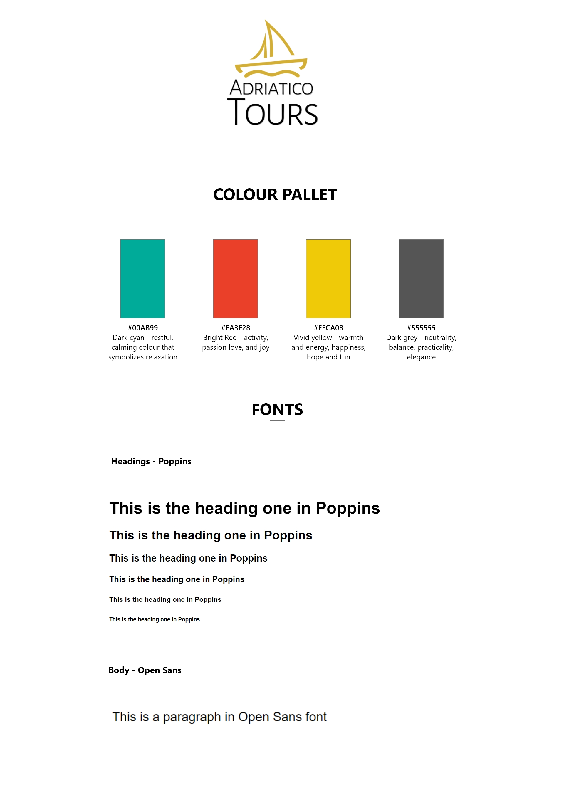
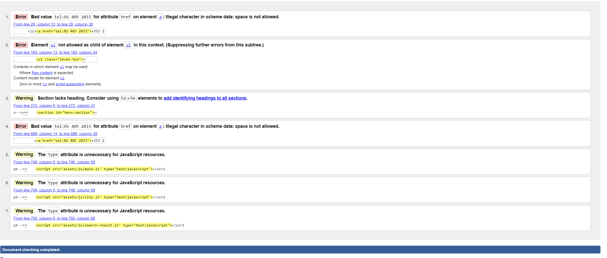
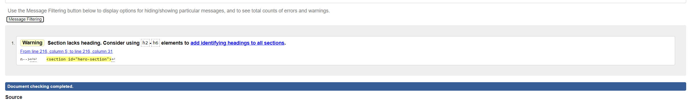
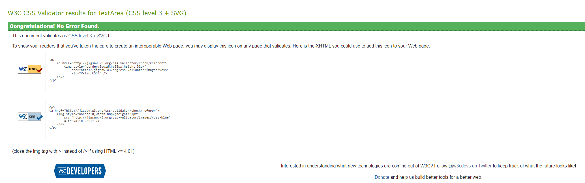

# **ADRIATICO TOURS**

## Project Overview

Adriatico tours is a travelling agency offering hotel booking in various cities all around Croatia. The website contains information about Croatia, propped up with beautiful imagery of Croatian sea and cities. With over 15 years of experience working with our partners, our primary goal is to ensure the best deals & vacation possible.
The main business objective is to offer a one-stop agency for Croatian vacation and provide a seamless booking process. 

# **Table Of Contents:**

-  **UX**
    -  Research and Analysis Phase
        - Business decision, long-term goals
        - User Stories
    -  Design Phase
        - Sitemap & User Flow
        - Colour pallet & Typography
        - Wireframes

   

  
- **Features & Layout**
- **Technologies & Resources Used**
- **Testing & Deployment**
- **Credits**
- **Acknowledgements**

 

# **UX**

Website is designed in a way to ensure an easy booking process & navigation through the content. 
All the sections are precisely separated to ensure clean and effective information architecture. 
Primarily focus is on the storytelling rather then pushy sales to gain trust and business understanding before proceeding with the booking.
Images are playing a key role in the whole user journey as they are the perfect trigger for "holiday mood", and can change a whole user perspective.

# **Research and Analysis Phase**

## **Brainstorming Ideas & User Stories**

The reason why I selected this project is the chance to work with the content I'm familiar with, and also practice some of the technologies we explored recently.
I've decided to narrow the offering and go with Croatian destinations only. I'm from Croatia and I have an understanding of cities and their offering alongside interesting facts and Croatian tradition.
As a start-up business I wanted to offer rich information about all destinations and ability to book a hotel in a desired location. 

**Long term goals:**

- enhancing current offering - destination packages (including flights, holiday programme, hotel & support). 
Potential users can book the whole trip on one website rather than researching each component individually, better price point guaranteed.
- improving search functionality - making all destinations and content easily searchable.
- including checkout processability for the user to fully book and pay for the trip instead of submitting a form request.
- include an online chat to improve the support throughout the user journey

### **User Stories**

As a **First Time** visitor I want to:

i.  Easily navigate through the website - this is achieved with the clean navigation both on big and small screens, and breadcrumbs to easily revert to the previous pages.

 ii.  Learn more about the company and booking rules - as mentioned before, website is focused on story telling which helps the user to understand more about the business and how the booking process works.

 
 iii.  Have a clear separation between services - at the moment there's only one service available (hotel booking) but in future development it's important to separate services in a way which ensures easy navigation and understanding of the
 selected service

 iv.  Have the support through the website journey - FAQ's are a good starting point to offer the support to the users. Additionally, there's scope for help articles & online chat support.

v.  Have a diverse selection off destinations to choose from - at the moment destinations are segmented into three regions with each one offering 3 cities to choose from. Depending on users desire - two of the regions are coast based (generally summer vacation), and the third one 
is focused on central part of Croatia and more on learning about the Croatian culture.

vi.  Have detailed information about chosen location/trip - each destinations is propped up with detailed information containing some history, interesting facts and best places to visit.

vii.  Easy & Efficient booking process - there are three steps to the booking process. Step one is to select a preferred destination, step two is to select a hotel in which user would like to stay and third step is to fill in a booking form.

 
As a **Frequent** visitor I want to:

i. Explore different destinations & activities for my next holidays 

ii. Subscribe to the newsletter to receive company updates & new offers - ensure up to date promotions, and deals are circulated to subscribed users, reward the users who are signed to the newsletter

iii. Have a seamless booking journey - keep on imporving on the booking process.

# **Design Phase**

## **Sitemap and user flow**

Sitemap was created to simplify website structure & decision on included pages - view here. (include a link to here text and link to sitemap)
The tool used to create the sitemap was lucid char.

To determine user flow for destination booking, I've created a flow chart designed in Adobe XD. This helped me to reduce the steps user has to take
to get to the end. - view here (include a link to here text and link to flow chart).

## **Colour pallet & Typography**

Colour pallet was determined by conducting competitor analysis and investigating the most commonly used colours for the selected business.
Poppins is the selected font for all the headings with sans-serif as a fallback. For the paragraphs and the rest of body text Open sans is the used font.

## **Wireframes**

All wireframes are created in Adobe XD. Each individual page contains desktop & mobile view. Homepage specifically has a mobile menu design & destination link dropdown.
Wireframes are saved in PDF file type and can be accessed [here](assets/documentation/wireframes)

# **Features & Layout**

The website consist of 6 unique pages.

- Homepage 
- Our Company
- Contact Us
- City Page
- Why Croatia Page
- Search Result Page

<ins>*Navigation*</ins>

The desktop version of navigation is relatively easy to use with clean and effective design in mind. The top bar servers as a contact details section and the main navigation consist of the company logo, functional search bar & navigation links.

**Search Bar Funcionality** - users can search for two terms "food" & "culture" which is initially a part of the placeholder to instruct the user what to search for.
Additionally, users can also search for individual destinations(current offering) which will redirect them to a relevant city page. If the user inputs the search term which is not stored in the js file the page will return no result found.

The mobile version navigation consists of contact details, a top bar, a hamburger menu, logo & search icon. The menu expands from left to right and consist of all navigation links. The search bar has the same functionality, but it expands and closes based on a users preference.

<ins>*Newsletter Section*</ins>

This section is consistent across all the pages and servers to capture customer emails and utilize email marketing by sending special offers, discounts, and new releases.
<ins>*Footer*</ins>

The top part of footer section consists of company logo, useful company liks such as Our company, FAQ's and Contact us & popular cities links.
The bottom part has comapny phone no., email and address. The copyright bar consist of credits and social icons.

<ins>*Homepage*</ins>

The homepage is divided into six sections:

- *Hero Section*: Which consist of Croatian sea image, a catchy title and social icons. Each time user visits the website, the text is slowly appearing on the screen mimicking the typing effect.
- *About Section*: This section is meant to briefly inform the customer about who we are and also convince them to choose to Learn more to potentially explore more about the company and build a certain level of trust.
- *Most popular destinations*: If the user happens to know preferred holiday destination, this section will serve as an opportunity to make an easy booking.
- *Why Choose Us*:  Main company facts that will server as trust builder and a section colour that will instantly grab users' attention. The goal here is to get the user to find more about our experience and expertise to assure them they are in safe hands.
- *Our partners & testimonials sections* - Each of the sections will provide the feeling of trust for new & potential consumers. Including partners, logo could indicate that we are working with prestige companies to ensure the best holidays possible. Testimonials section, however, shows user perspective of the service and experience they received from us, and mostly enables users to empathize with those who left the reviews

<ins>*Our Company*</ins>

Our Company page is divided into three sections:

- *Hero Section*: This section inform the users about the company in the greater details and is propped with a cacthy image of Croatian National Park Plitvice.
- *How it works*: This section is meant to present a seamless process user has to take to make a booking with us and everything that goes into it.
- *FAQ's*: Lastly, faq's section will consist of some of the most common questions users can ask to avoid them reaching out and potentially saving resources for the company.

<ins>*Contact Us*</ins>

The Contact Us page is divided into 2 sections:

- *Hero image & form section*: the form consist of 5 main fields and opportunity for the users to raise any questions and queries they might have.
When the form is submitted the "Message Sent" section appears on the screen for three seconds to inform, the user submission was successful. The form is also directly sent to the email address and correctly pulling all the fields user input.
- *Company location*": in case user would love to visit the agency and make the booking in person they have the instruction provided with google maps on how to find our location.

<ins>*City Page*</ins>

The City Page is divided into 4 sections

- **Hero Section**: each city (8 in total) has three images which are presented with the slideshow.
- **City Intro**: this section servers as a good reference to city history and some interesting facts which can grab users attention and alleviate holiday decision.
- **City location**: users can get an understanding of city structure and some of the facilities it offers.
- **Hotel Offering**: each city has three hotel offers. The filtering system is provided to segment the hotel order based on user preference(sort by: stars, price low to high & high to low). Each of the hotels has price, facts & star ratings on the front-facing.
The user can "See More" - which launches the popup with additional hotel images, hotel position on the map & additional hotel information (about hotel & facilities). The option "Book Now" will also launch a pop-up with passengers selection dropdowns for adults and children, booking form and summary section that calculates the total price based on passenger selection.

<ins>*Why Croatia page*</ins>

Why Croatia page is divided into six sections:

- *Hero image section*: contains a beautiful image of a small island in Croatia.
- *Intro text*: Informative text about Croatian country to tell the story to the users and spark the interest.
- *Facts Section*: contains five facts about Croatia: currency, language used, the capital city and how to say good morning and good evening in Croatian.
- *Top things carousel*: the six facts are spread out in most of the cities we are offering. They are mostly famous Croatian monuments and culture.
- *Currency Converter*: opportunity to convert Euro to Croatian kuna to better understand currency difference.
- *Most popular destinations*: This is the same section from the homepage. But, at this stage of the customer journey user should have a clearer understanding of Croatian culture and offering and therfore a good time to make a decision on the holiday options.

<ins>*Search Result Page*</ins>

Search result page contains two sections:

- *Search results*: based on user input it can be either food or culture and based on that search returns relevant content
- *Most popular destinations*: another possiblity to push a user towards booking a holiday, also if the search returns no result found at least it shows some actions user can take.

# **Technologies & Resources Used**

## **Languages Used**

 **HTML5**

  **CSS3**

  **JavaScript**

## **Frameworks & Processors**

  **SCSS** - scss was used to enable quicker and more efficient coding. I've used the processor on purpose to learn about it and grow as a developer even though it's not a requirement for the project and it won't affect the grade.

  **JQuery** - jQuery was used as a good addition to JavaScript to enable efficent coding and easier solutions to the problem.

  **Bootstrap** - Bootstrap framework was used only for small code snippets such as slide shows and showing elements such as form labels to screen readers only. 

## **Workspace, version control and Repository storage**

  **GitPod** - All code is written in gitpod cloud environment, committed and pushed to GitHub

 **Git** - Distributed Version Control tool to store versions of files and track changes.

 **GitHub** - A cloud-based hosting.

## **Integrations**

- [Google Maps API]("https://developers.google.com/maps/documentation/javascript/overview")

The Google Maps API was mostly used for City page. Each city and hotel is shown on the map, in addition to the marker on the map for each hotel.
Additionally, I used the maps to show company location on the contact us page.

- [EmailJS]("https://www.emailjs.com/")

EmailJs has been used for both contact us form and booking form. The two templates were created in the software to enable sending correct parameters. Each of the fields is sent through as a parameter and sent directly to my email address. 

- [Rapid API]("https://rapidapi.com/apiworker.com/api/currency-converter13")

I have used Currency Converter API from Rapid API marketplace to enable the user to convert from Euro to Croatian Kuna currency on the Why Croatia Page.
The API is free to use with 500 calls a day as a hard limit.

## **Resources & Media**

 **Font Awsome** - Font awsome was used for the most of the icons on the page enabling usage of after and before pseudo elements with ease. 

 **Google Fonts** - Google fonts was used for importing desired fonts to the page.

- **Flat Icon** was used to bypass limited access of icons on Font Awsome (I used the paid version to avoid crediting each designer for their icons.)
- **Canva** was used for all the imagery on the page except the Hotel images.
- **Adobe XD** - used for creating wireframes. Click [here](assets/documentation/wireframes) to access the wireframes folder.
- **Stack Overflow** - General resource for code and problem solving
- **W3 School** - General resource for code and problem solving

# **Testing & Deployment** 

## **Validation**

- #### HTML Validation 

I have used [W3C Markup validator]("https://validator.w3.org/") to check all HTML pages for possible errors.
The below are highligthed unique issues with each page

First Check HTML page:

Validator returned multiple warnings and errors as visible in the image below.

After implementing fixes, I managed to address all the issues except one warning which expects heading element in a section where I don't need one, so I consider this not an issue.

The rest of the pages had same issues as HTML page, altough some of them had unique issues such as missing alt tag, misuse of aria-label in breadcrumbs section & warnings for empty headings(which are populated with JS dynamically)
The errors are removed from all HTML pages.

- #### CSS Validation 

Before Validating the CSS I used [Autoprefixer]("https://autoprefixer.github.io/") to add prefixes to all CSS properties which are not supported by all browser. I have used flex property for most of the elements, so it was crucial 
to add prefixes to achieve the correct site rendering across browsers.

I have used  [W3C CSS Validator]("https://jigsaw.w3.org/css-validator/") to validate CSS file. The CSS syntax was correct after the first try.

## **Fixed Bugs**

**Dropdown mobile-menu funcionality** - when it was created each of the second level dropdowns would expand and would be closed only on click. This caused issues for menu height especially at mobile devices because the rest of the navigation wasn't visible.
To fix this I implemented the funcionality to always enable  only one dropdown to expand and close anothers dynamically. 

 
